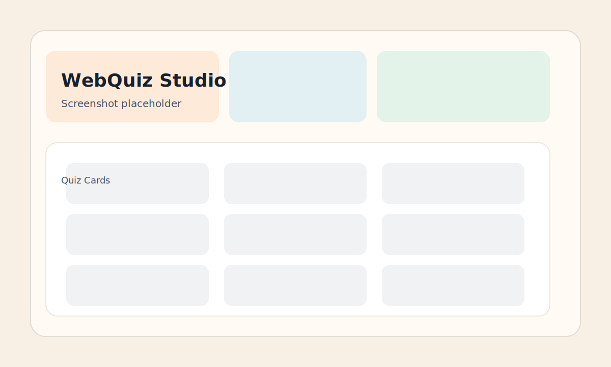

# WebQuiz Studio

A small quiz app that supports creating, solving, and tracking quizzes. It works with a live API (JSON Server) and automatically falls back to local storage if the API is offline.

## Screenshot



> Replace this placeholder with a real screenshot after you run the app.

## Learning Path

1. Start JSON Server and the static server.
2. Call `GET /quizzes` and inspect the response structure.
3. Create a quiz with `POST /quizzes` and confirm it appears in the UI.
4. Remove a quiz with `DELETE /quizzes/:id`.
5. Submit an attempt with `POST /completed`.
6. Turn off the API and verify the app switches to local storage.
7. Turn the API back on and use **Refresh** to switch to live mode.
8. Add a filter like `/quizzes?title_like=HTML` and check the results.
9. Add pagination like `/quizzes?_page=1&_limit=5`.
10. Move API helpers into a separate file (optional refactor).

## Project Structure

- `index.html`
- `assets/css/styles.css`
- `assets/js/app.js`
- `data/db.json`
- `server/mock.php` (optional PHP mock)
- `docs/api.md` (API description)
- `docs/api.http` (ready-to-run HTTP requests)

## Run With JSON Server

1. Start the API:

```bash
npx json-server --watch data/db.json --port 8888
```

2. Serve the frontend (from the project root):

```bash
python3 -m http.server 8080
```

3. Open [http://localhost:8080](http://localhost:8080) in the browser.

## Offline Mode

If the API is not reachable, the app switches to local storage automatically. Use the **Refresh** button to re-check the API.

## Documentation

- `docs/api.md` lists endpoints and request/response examples.
- `docs/api.http` contains ready-made requests for the VS Code REST Client extension.

## GitHub Pages

This repo includes a GitHub Actions workflow at `.github/workflows/pages.yml` that deploys the site on every push to `main`.

To enable Pages:

1. Go to **Settings** → **Pages** in your GitHub repo.
2. Set **Source** to **GitHub Actions**.
3. After the first deploy, your site will be live at `https://YOUR-USERNAME.github.io/YOUR-REPO/`.

## Configuration

- Update the API URL inside `assets/js/app.js` if your API runs on a different port.
